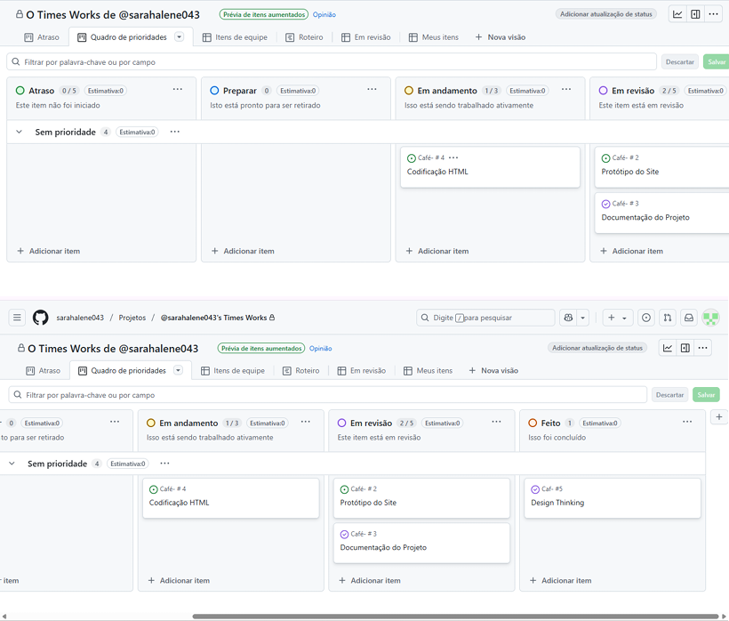

# Metodologia

Pré-requisitos: <a href="03-Product-design.md"> Product design</a>

Descreva aqui a metodologia de trabalho do grupo para abordar o problema. Inclua definições sobre os ambientes de trabalho utilizados pela equipe para desenvolver o projeto. Isso abrange a relação dos ambientes utilizados, a estrutura para a gestão do código-fonte, além da definição do processo e das ferramentas por meio dos quais a equipe se organiza (gestão de equipes).

## Relação de ambientes de trabalho

Os artefatos do projeto são desenvolvidos a partir de diversas plataformas. A relação dos ambientes com seus respectivos propósitos é apresentada na tabela a seguir:

| Ambiente | Plataforma | Link de Acesso |
|---|---|---|
| Processo de Design Thinking | Word | Não existe  |
| Repositório de código fonte | GitHub | GIT HUB TIMES WORKS  |
| Documentos do projeto | Word | Documentação Word  |
| Gerenciamento do projeto | GitHub Projects | Git Hub Projects  |
| Projeto de interface | Figma | Projeto de Interfaces  |
| Hospedagem | Não decidido | Não existe  |

## Planejamento do projeto

### Divisão de papéis

A equipe utiliza o Scrum como base para definição do processo de desenvolvimento.

* Scrum Master: MATEUS CORREIA DOS SANTOS  
* Product Owner: MATEUS CORREIA DOS SANTOS 
* Equipe de Desenvolvimento: JÂNIO JÚNIO DE FREITAS CARDOSO, JOSÉ PEDRO MENDES NETO, LUCAS HENRIQUE P. DA SILVA, MATEUS CORREIA DO SANTOS. 
* Equipe de Design: MATEUS C. DOS SANTOS, JOSÉ PEDRO M. NETO, JÂNIO J. DE FREITAS CARDOSO.

### Processo

> ⚠️ **APAGUE ESTA PARTE ANTES DE ENTREGAR SEU TRABALHO**

O grupo faz uso do Quadro de Controle de Tarefas – Kanban para acompanhar o andamento do projeto, a execução das tarefas e o status de desenvolvimento da solução.

 | https://github.com/orgs/ICEI-PUC-Minas-PCO-SI/projects/113
 
### Ferramentas

Os artefatos do projeto são desenvolvidos a partir de diversas plataformas, e a relação dos ambientes com seus respectivos propósitos é apresentada na tabela a seguir:

| Ambiente                      | Plataforma        | Link de Acesso              |
| :---------------------------- | :---------------- | :-------------------------- |
| Processo de Design Thinking   | Word              | Não existe                  |
| Repositório de código fonte   | GitHub            | GIT HUB TIMES WORKS         |
| Documentos do projeto         | Word              | Documentação Word           |
| Gerenciamento do projeto      | GitHub Projects   | Git Hub Projects            |
| Projeto de interface          | Figma             | Projeto de Interfaces       |
| Hospedagem                    | Não decidido      | Não existe                  |

---

## Ambientes e Frameworks para Desenvolvimento de Aplicações Móveis

* **Ambiente de Desenvolvimento:** Visual Studio Code
* **Framework:** React Native