# Projeto de interface

Pré-requisitos: <a href="03-Product-design.md"> product design</a>

 Visão geral da interação do usuário pelas telas do sistema e protótipo interativo das telas com as funcionalidades que fazem parte do sistema (wireframes).

 Apresente as principais interfaces da plataforma. Discuta como ela foi elaborada de forma a atender os requisitos funcionais, não funcionais e histórias de usuário abordados na parte de <a href="03-Product-design.md"> product design</a>.

 ## User flow

## Wireframes

##### Breve apresentação e formulário de login
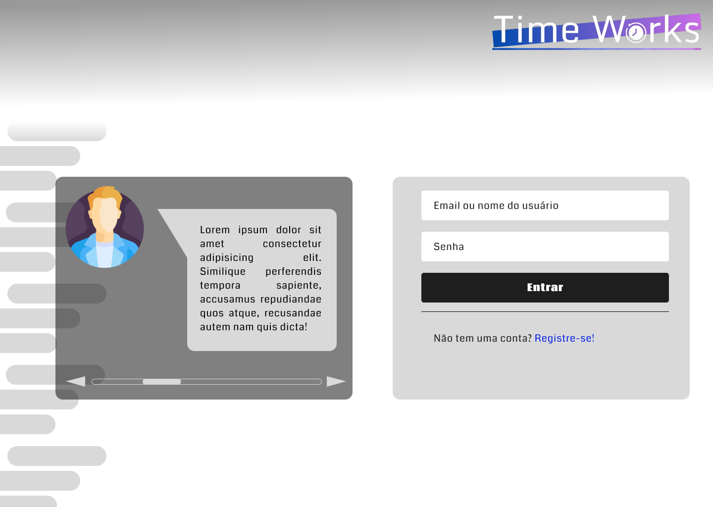Add commentMore actions

##### Tutorial de primeiro acesso ao sistema
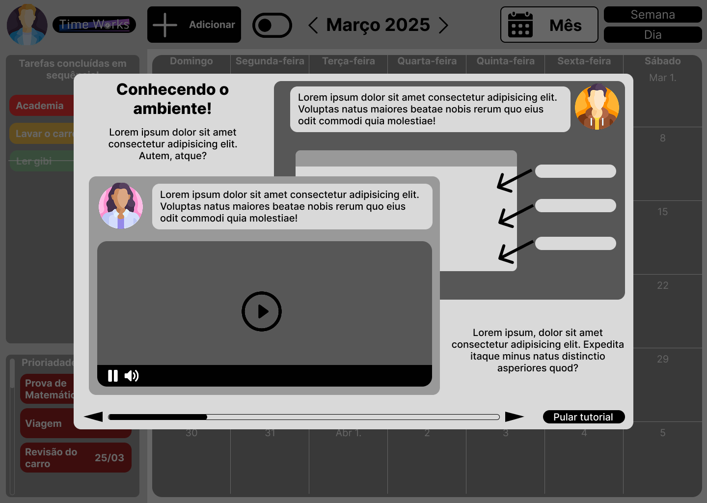

##### Visualização do calendário mensal
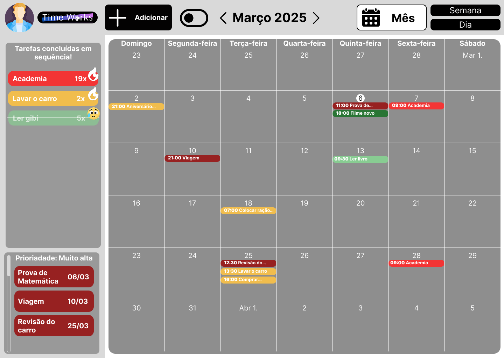

##### Visualização do calendário semanal
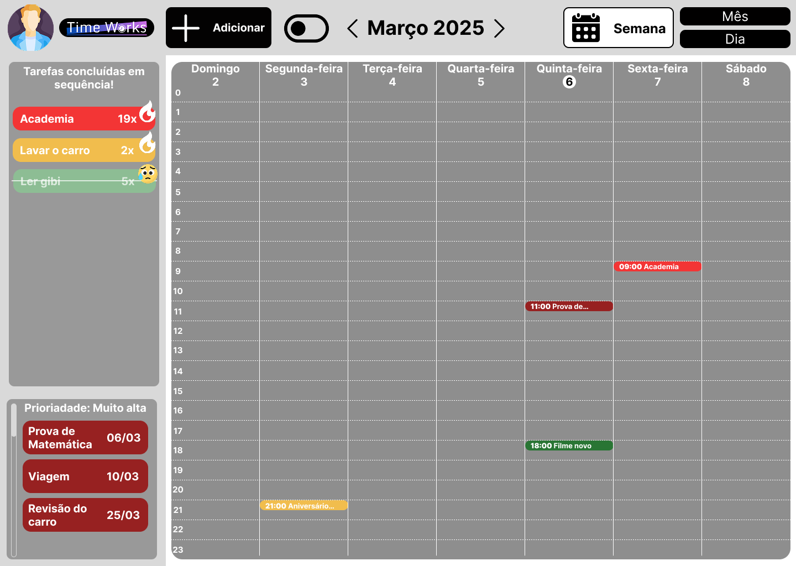

##### Visualização do calendário diário
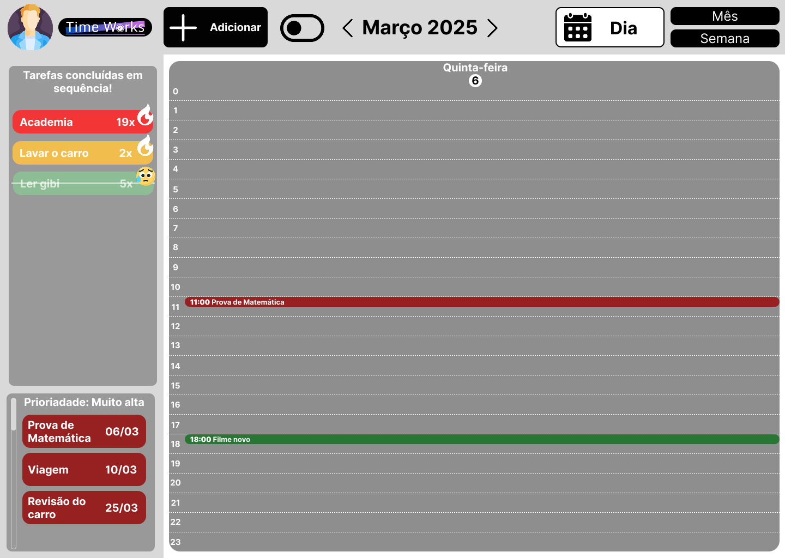

##### Perfil do usuário
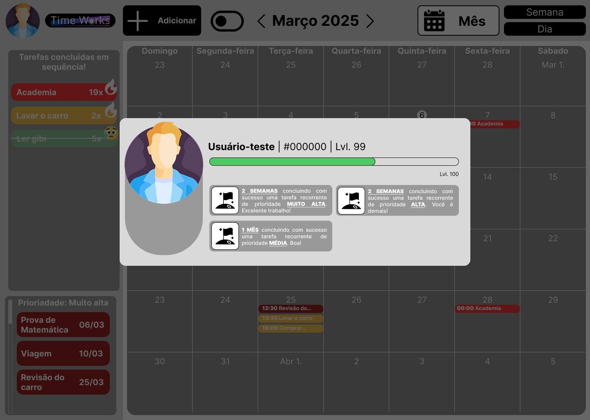

##### Formulário de adição de nova tarefa
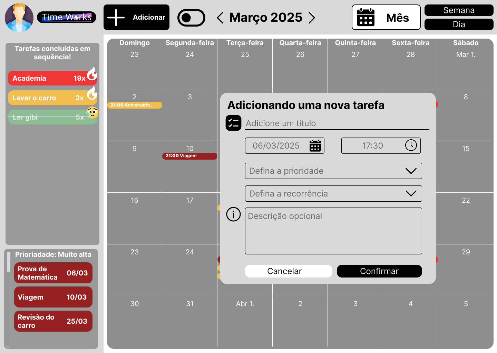
 
##### Formulário de visualização de tarefa já adicionada
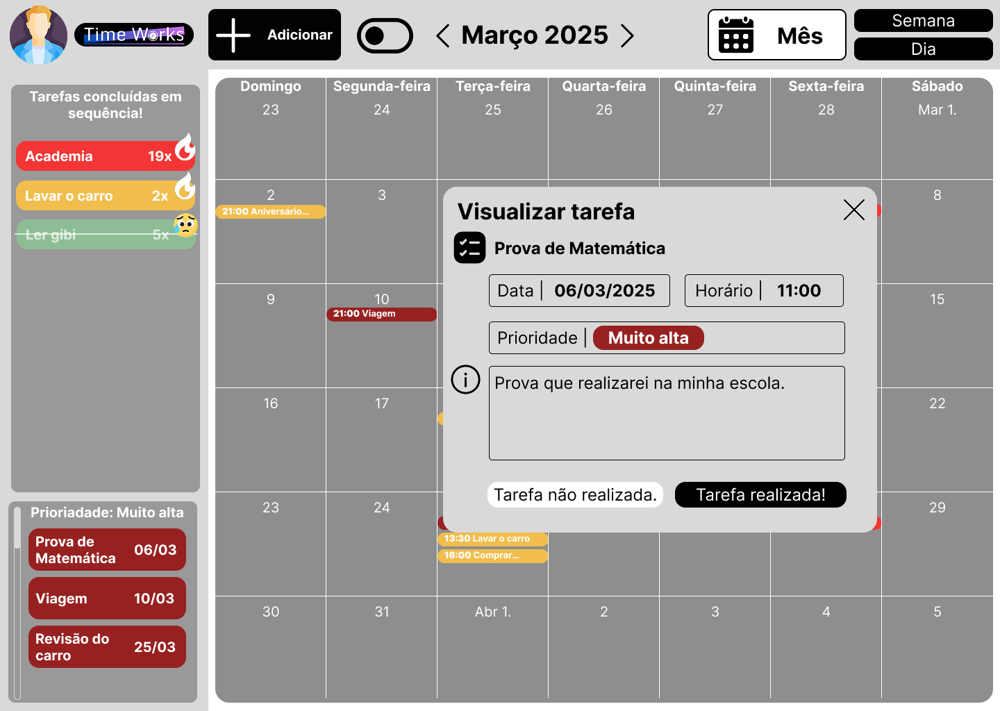
 
##### Visualização da To do List
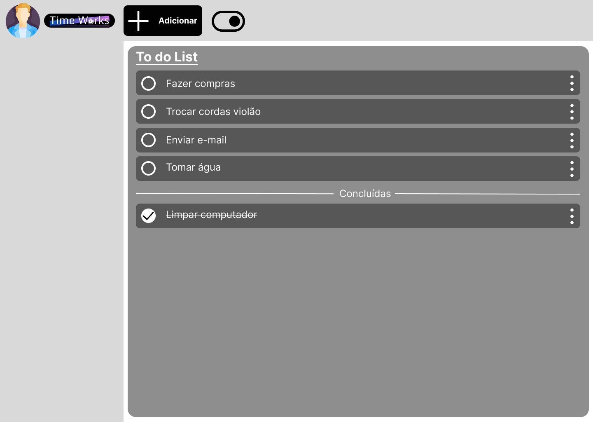
 
##### Opções da To do List
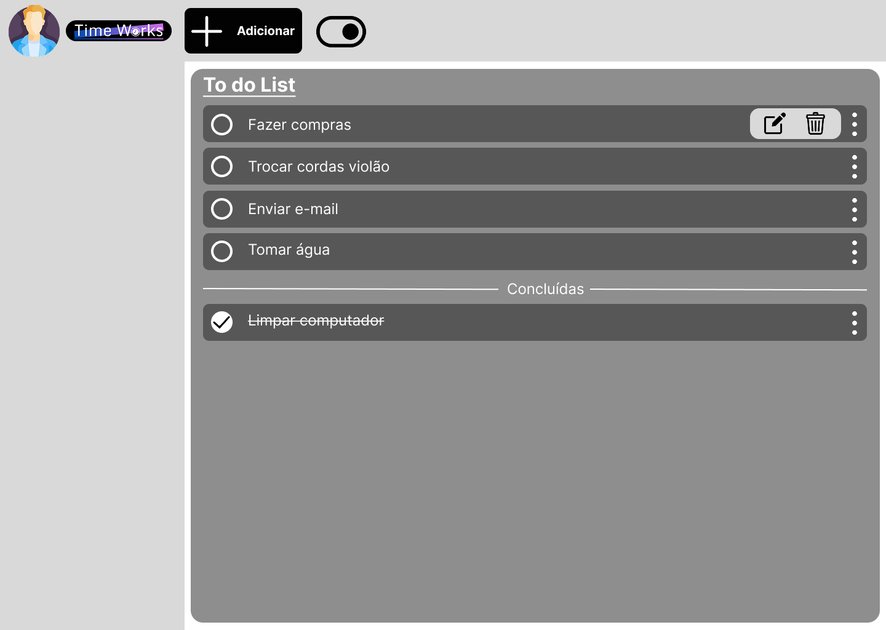
 
##### Adcionar nova tarefa na To do List
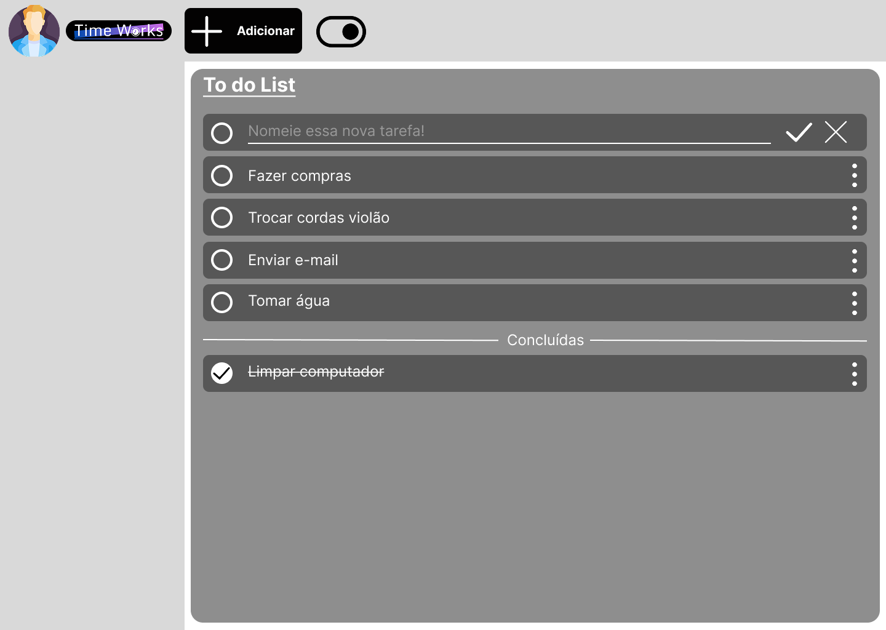

### Protótipo Interativo

✅ [Protótipo interativo Time Works](https://www.figma.com/proto/GxgUB7r0g4iYMDRvzQYser/Wireframes-TIAW?node-id=7-104&t=LZJkEWwDSo4Dv0MQ-1&scaling=min-zoom&content-scaling=fixed&page-id=0%3A1&starting-point-node-id=1%3A2)  