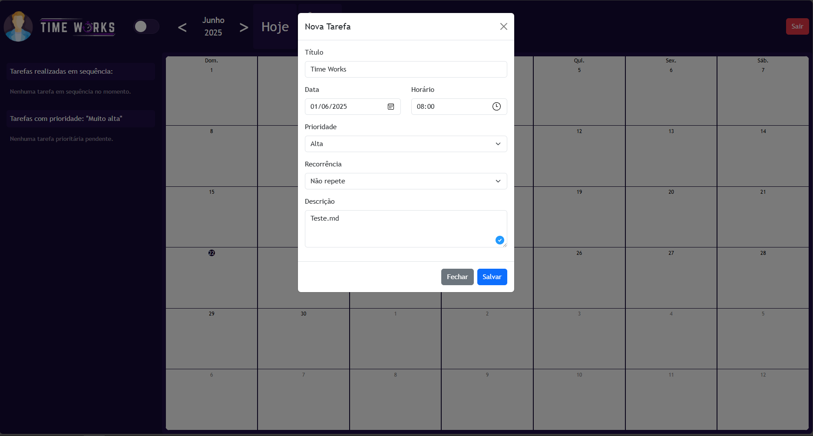
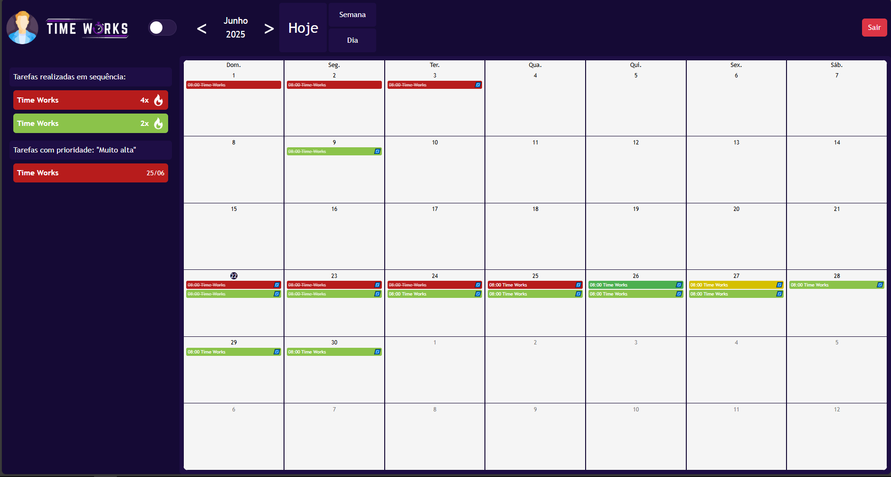
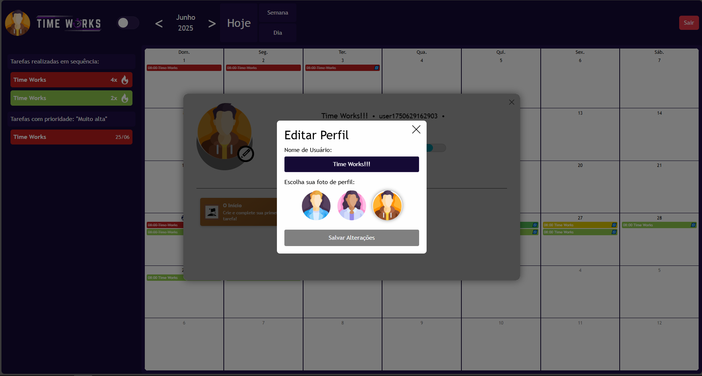

# Arquitetura da solução

<span style="color:red">Pré-requisitos: <a href="05-Projeto-interface.md"> Projeto de interface</a></span>

A Arquitetura do projeto foi toda feita em html,css e javascript.

## Funcionalidades

Esta seção apresenta as funcionalidades da solução.

##### Funcionalidade 1 - Cadastro de Usuário

O sistema deve permitir que os usuários se cadastrem e criem perfis pessoais, incluindo informações como nome, idade e preferências. 

* **Estrutura de dados:** [Usuário](#estrutura-de-dados---usuário)
* **Instruções de acesso:**
    * Abra o sistema e na tela de login, clique em "Registre-se!". 
    * Preencha as informações necessárias para criar seu perfil.
* **Tela da funcionalidade**:

    

##### Funcionalidade 2 - Criação de Tarefas

Os usuários devem ser capazes de criar, editar e excluir tarefas, definindo prazos e prioridades. 

* **Estrutura de dados:** [Tarefa](#estrutura-de-dados---tarefa)
* **Instruções de acesso:**
    * No calendário, clique 2 vezes em um dia do calendário.
    * Preencha os detalhes da tarefa, como título, data, horário, prioridade e descrição.
    * Confirme para adicionar a tarefa. 
* **Tela da funcionalidade**:

    

##### Funcionalidade 3 - Gamificação

O sistema deve incluir elementos de gamificação, como recompensas, pontos e desafios diários, para incentivar a conclusão de tarefas. 

* **Estrutura de dados:** [Recompensa](#estrutura-de-dados---recompensa), [Desafio](#estrutura-de-dados---desafio), [Pontuação](#estrutura-de-dados---pontuação).
* **Instruções de acesso:**
    * Ao completar tarefas, o usuário receberá pontos e recompensas, que serão exibidos no perfil e em áreas designadas da interface. 
    * Desafios diários serão apresentados para incentivar o engajamento. 
* **Tela da funcionalidade**: Os elementos de gamificação (pontos, recompensas) podem ser visualizados no perfil do usuário. 



##### Funcionalidade 4 - Personalização

Os usuários devem poder personalizar suas rotinas, metas e preferências de notificação, adaptando o sistema às suas necessidades individuais. 

* **Estrutura de dados:** [Preferências do Usuário](#estrutura-de-dados---preferências-do-usuário)
* **Instruções de acesso:**
    * Acesse as configurações de perfil para personalizar rotinas e preferências. 

    

### Estruturas de dados

Descrição das estruturas de dados utilizadas na solução com exemplos no formato JSON.Info.

##### Estrutura de dados - Usuários  

Registro dos usuários do sistema utilizados para login e para o perfil do sistema.

```json
  {
    "id": "user1750629162903",
      "senha": "123",
      "name": "Time Works!!!",
      "profilePic": "assets/img/man2.png",
      "xp": 90,
      "level": 1,
      "hasSeenTutorial": true,
      "unlockedAchievements": [
        1,
        2
      ]
  }
```

### Módulos e APIs

Esta seção apresenta os módulos e APIs utilizados na solução.

**Ambiente de Desenvolvimento:**

* Visual Studio Code 

**Framework:**

* React Native 

**Ferramentas de Projeto e Documentação:**

  * Word (para Processo de Design Thinking e Documentos do projeto) 
  * GitHub (para Repositório de código fonte e Gerenciamento do projeto com GitHub Projects) 
  * GIT HUB TIMES WORKS 
  * Git Hub Projects 
  * Figma (para Projeto de interface) 
  * Projeto de Interfaces 

## Hospedagem

A hospedagem do projeto é no **https://deploy-site-time-works.onrender.com/login.html**.