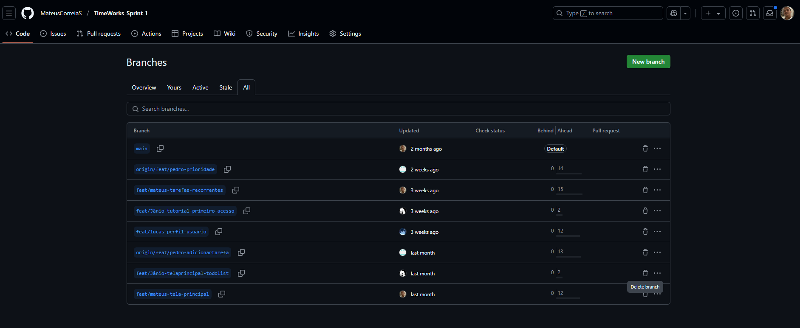

# Registro de testes de software

Pré-requisitos: <a href="05-Projeto-interface.md"> Projeto de interface</a>, <a href="08-Plano-testes-software.md"> Plano de testes de software</a>

Os teste realizados em grupo foram registrados por meio dos commits no repositório a parte.

